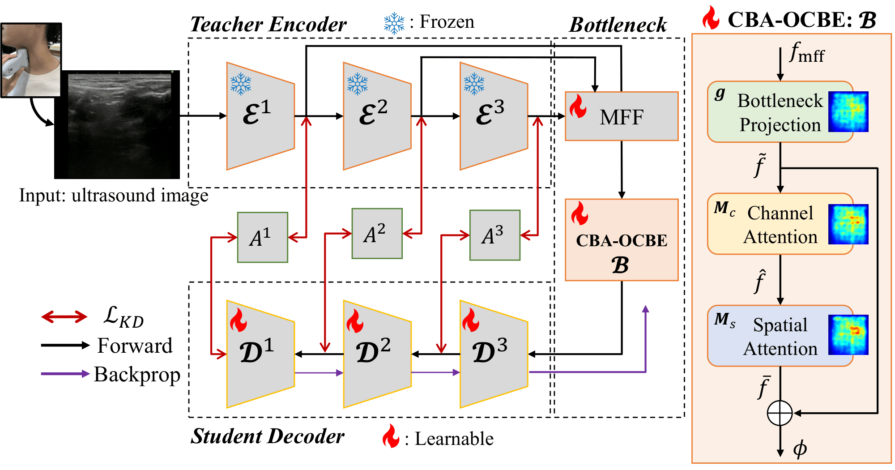
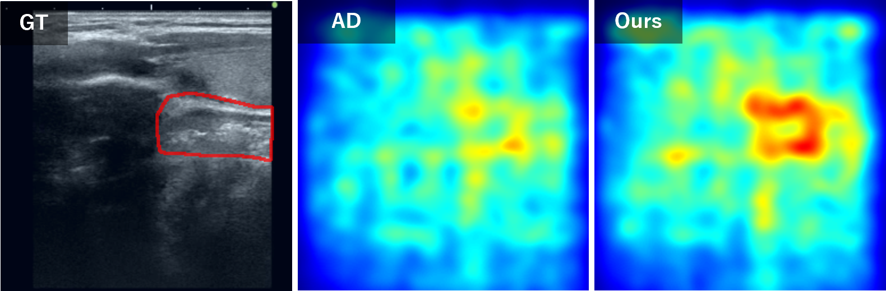

# Investigation of Swallowing Function Assessment Using Reverse Knowledge Distillation with a Focus on Spatial Features

[[IPSJ](./paper/IPSJ.pdf)] [[予稿](./paper/B-2-3.pdf)] [[卒業論文](./paper/thesis.pdf)] [[IEICE](./paper/IEICE.pdf)]

実装言語: Python



## Abstract
In recent years, medical image processing using AI has attracted increasing attention owing to population aging and a shortage of physicians.
In otorhinolaryngology, the number of patients with dysphagia has increased markedly, leading to a growing demand for bolus detection models for ultrasound images used in clinical rehabilitation.
Methods based on unsupervised anomaly detection can be trained using only normal samples without exhaustively annotating all swallowing patterns; however, their detection accuracy still leaves room for improvement.
In this study, to better capture the spatial relationship between the esophagus and the bolus, we incorporate an attention mechanism that provides spatial selectivity into a reverse knowledge distillation--based unsupervised bolus detection model.
Our core idea is that effectively preserving normal features during feature compression in the reverse knowledge distillation process is crucial for improving bolus detection accuracy.
To this end, the proposed model employs both channel-wise and spatial attention to produce more refined outputs.
Through extensive experiments on a swallowing ultrasound image dataset, we investigate the effectiveness of the proposed method and appropriate model configurations.

## Install
```
conda create -n AD-RD python=3.8  # python3.8
pip install torch torchvision torchaudio --index-url https://download.pytorch.org/whl/cu121   # pytorch for cuda12.1
conda install matplotlib
conda install scikit-learn
pip install opencv-python # pip
conda install scipy
conda install pillow
conda install scikit-image
conda install pandas
```

## Dataset
Swallowing Ultrasound Datast


## Quick Guide
### train
以下を実行することで，学習過程が`./log`に保存されます．
```
python main_swallowing.py
```

### test
以下を実行することで，推論時の評価値が`./eval`に保存されます．
```
python eval.py
```

### visualisation
以下を実行することで，GT，hmap，pred画像が`./img/{class}`に保存されます．
```
python fig.py
```

### Tips
* `__pycache__` $\rightarrow$ キャッシュ．
* `.idea` $\rightarrow$ プロジェクト設定．
* `checkpoints` $\rightarrow$ モデルの重み．
* `data` $\rightarrow$ 卒業論文で使用した評価値およびグラフ．
* `eval` $\rightarrow$ 評価指標毎のグラフ．
* `gao` $\rightarrow$ gao2025unsupervisedを自環境で実装した際のプログラム．
* `img` $\rightarrow$ カテゴリ毎のGT，hmap，pred画像．
* `img_cmp` $\rightarrow$ カテゴリ毎のGT-hmap-pred画像．．
* `log/epoch` $\rightarrow$ 学習過程．
* `log/graph` $\rightarrow$ 学習過程のグラフ．
* `log/json` $\rightarrow$ 学習過程．
* `log/time` $\rightarrow$ 計算時間．
* `others` $\rightarrow$ 比較実験，モデル構成検討の際に使用したプログラム．
* `pre` $\rightarrow$ deng2022anomalyを自環境で実装した際のプログラム．
* `swallowing` $\rightarrow$ 本実験で使用した嚥下超音波画像データセット．
* `dataset_swallowing.py` $\rightarrow$ 嚥下超音波画像データセットの前処理．
* `dataset.py` $\rightarrow$ MVTec ADデータセットの前処理．
* `de_resnet.py` $\rightarrow$ Decoderのバックボーンネットワーク．
* `eval.py` $\rightarrow$ 推論．
* `fig.py` $\rightarrow$ 可視化．
* `LICENSE` $\rightarrow$ ライセンス．
* `main_swallowing.py` $\rightarrow$ 学習．
* `overview.png` $\rightarrow$ 概要図．
* `paper.pdf` $\rightarrow$ 卒業論文．
* `readme.md` $\rightarrow$ このreadme．
* `requirements.txt` $\rightarrow$ 環境設定．
* `resnet.py` $\rightarrow$ Encoder，OCBEモジュールのバックボーンネットワーク，およびCBAMの実装．
* `results.png` $\rightarrow$ 定性的評価図．
* `test.py` $\rightarrow$ 計算用関数群．
* `utils.py` $\rightarrow$ ユーティリティ関数群．


## Method
卒論参照


## Results
| Category | Bread | Cracker | Jelly | Pudding | Soda | Yogurt | Yokan | Avg |
|---|---|---|---|---|---|---|---|---|
| AD | 83.6 / 62.2 | 81.7 / 53.9 | 82.6 / 57.3 | 83.0 / 56.0 | 78.3 / 41.7 | **85.1 / 60.6** | **84.7 / 59.2** | 82.7 / 55.8 |
| **Ours** | **86.2 / 64.4** | **84.8 / 55.4** | **85.3 / 59.9** | **85.4 / 59.5** | **81.2 / 44.7** | 84.8 / 59.4 | 84.5 / 59.0 | **84.6 / 57.5** |




## Citation
If you find the work useful in your research，please cite our papar
```
@article{suzuki2026investigation
  title={Investigation of Swallowing Function Assessment Using Reverse Knowledge Distillation with a Focus on Spatial Features},
  author={Haruhito, Suzuki and Makoto, Sasaki and Hagihara, Yoshihiro and Hotta, Katsuya},
  journal={},
  volume= {},
  number= {},
  pages= {},
  year={2026},
  publisher={}
}
```
